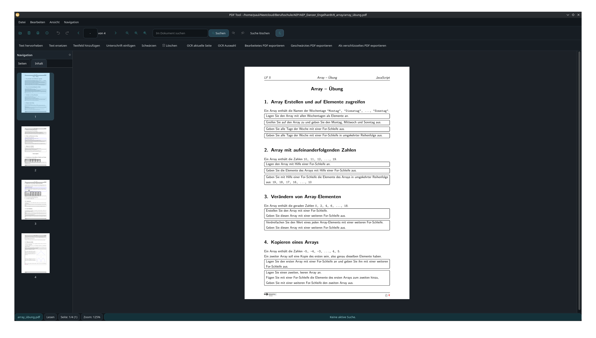
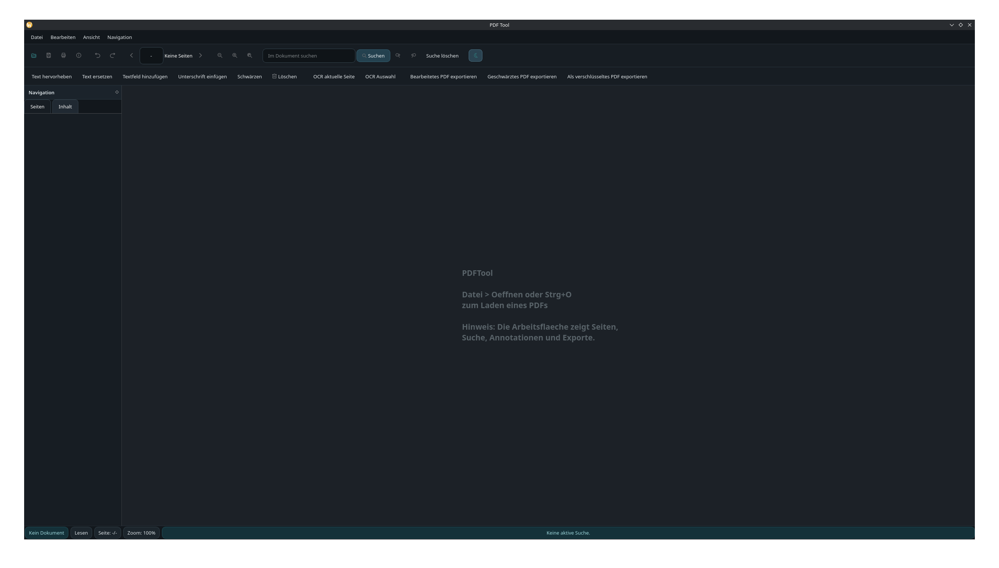

# 🧩 PDFTool

<p align="center">
  
</p>

<p align="center">
  <b>Local-first PDF editor for Linux – OCR, Annotation and Redaction</b>
</p>

---

## 🚀 Overview

PDFTool is a local-first PDF editor designed for Linux desktop workflows.

It focuses on:

- 📄 Reading and navigating PDFs  
- ✏️ Annotation and editing  
- 🔒 Redaction (data masking)  
- 🔍 OCR (text extraction)  
- 📤 Exporting modified documents  

👉 All processing happens locally – no cloud dependency.

---

## 📸 Screenshots

<p align="center">
  
  
</p>

---

## 🧠 Key Features

- PDF viewing & navigation  
- Annotation & editing  
- Redaction (data masking)  
- OCR with Tesseract  
- Local processing (no cloud)  

---

## 🏗️ Architecture

### Core Components

- **Qt 6** → UI Layer  
- **Poppler** → PDF rendering  
- **Tesseract** → OCR engine  
- **qpdf** → PDF processing  

---

### Workflow

User → Qt UI → Processing Layer → Export Pipeline  

- UI handles interaction  
- Poppler renders PDF  
- Editing is handled via overlays  
- Export writes changes into a new PDF  

---

## ⚙️ Requirements

- Linux (Debian recommended)  
- Qt 6  
- Poppler  
- (Optional) Tesseract  
- (Optional) qpdf  

---

## 🚀 Build

```bash
git clone https://github.com/linuxlearner-germany/PDF_tool
cd PDF_tool

mkdir build
cd build

cmake ..
make
